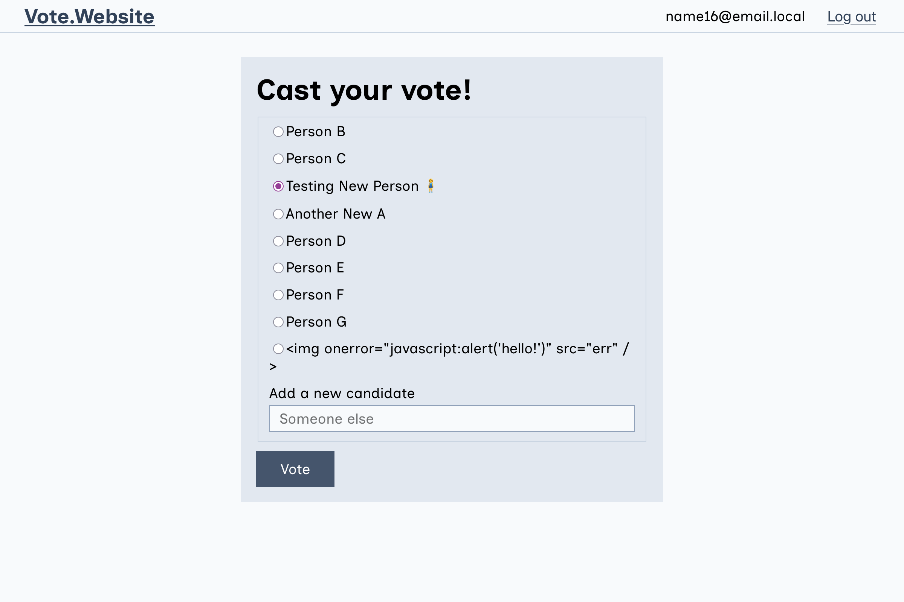

# Voting app

This is an app for voting on a set of up to 10 candidates, with one vote per person. Users will need to sign up or log in before they can view the form to vote. Once registered, they can vote or (if there are less than 10 candidates) submit a new candidate.

Anyone can view the voting results at `/results`, which will show a list in descending order of the ranked candidates.



## Data

In this app we have Users, Candidates, and Votes. A vote is the mapping between a user & candidate (has user_id and candidate_id), and the user ID must be unique for each vote (ensuring users only vote once).

Users are not validated as real users, though you must have a unique email to sign up. Form fields are not checked on signup, and passwords are not checked when logging in.

Candidates can be created until we hit 10 items, at which point creating more returns an error (the UI is removed at this point to avoid this).

The data for the results table is built up by grouping the votes, allowing for a single query to fetch the result count from the database. A second query gets all the candidates for labelling, since there are <=10 this unlimited query should not be a performance issue, but in a larger-scale app I might approach this differently.

## API

I've used an API controller pattern for candidates and votes, as those will only ever be interacted with via the React app. Although currently the candidates and vote data is passed into the app via props from the view, this could also have an API fetch component to live-poll the candidates and results in the case where multiple people might be using the app.

## Accessibility

I've kept everything basically accessible to meet WCAG AA standards — form fields are labelled, the radio inputs are grouped in a labelled fieldset, colors should pass contrast ratios. In a production app I would also want to include aural feedback to a screen reader user for when the form is submitted, using aria live regions. Similarly for all users, there could be better (any) error handling and success messages.

---

## Installation

Your development environment should have:

- Ruby v3.1.2
- [Bundler](https://bundler.io/)
- Node v20.18.2
- Yarn v1.22.19
- git
- [SQLite3](https://www.sqlite.org/)

Initialize git, install the application, and initialize the database:

```sh
# First, download the zip file, unzip the directory,
# and navigate into the project directory. Then:
git init
git add .
git commit -m "Initial files provided"
bundle install
bundle exec rake db:migrate

# Install JS packages, including React
yarn install
```

## Running the app

```sh
bundle exec rails server
```

Visit [http://localhost:3000](http://localhost:3000) in your browser

For asset live reloading, run:

```sh
./bin/shakapacker-dev-server
```

If the assets ever get out of sync, delete `/public/packs` and restart your
Rails server (and your shakapacker-dev-server if it was running).

## Running tests

The included test suite uses Rspec and Capybara.

Check out `spec/requests/` for example tests.

```sh
# Run all tests
bundle exec rspec

# Run one test file
bundle exec rspec <path/to/the/file.rb>

# Run one test case inside a test file
bundle exec rspec <path/to/the/file.rb>:<line_number>
```

## Accessing the Rails console

```sh
bundle exec rails console
```

## Debugging

You can open up a debugging console by adding `binding.pry` anywhere in test or
application code.

Example:

```rb
def show
  binding.pry
  render json: { data: @my_object }, status: :ok
end
```

In this example, when the `show` method is hit during click testing or a test,
a debugger will open up in the terminal, where you can inspect values:

```rb
@my_object.id
@my_object.valid?
```

Step to the next line with `next`. Resume regular code execution or tests with
`continue`.
